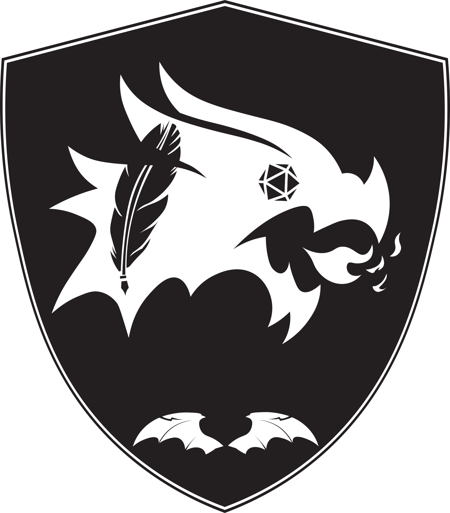

<p align="center">
  
</p>

<h1 align="center">Draconae Project</h1>

<p align="center">
  <em>Your digital companion for creating and managing Dungeons & Dragons 5th Edition characters!</em>
  <br><br>
  <a href="https://github.com/KoRIOz675/DnDCharacterApp/actions">
    
  </a>
  
  <a href="LICENSE">
    
  </a>
  <!-- You can add more badges like Java version, JavaFX version, last commit, etc. -->
</p>

---

## 📜 Table of Contents

- [📖 About The Project](#-about-the-project)
    - [🛠️ Built With](#️-built-with)
- [✨ Core Features](#-core-features)
- [🛠️ Development Progress](#️-development-progress)
    - [🚧 Currently In Focus](#-currently-in-focus)
    - [✨ Recently Added](#-recently-added)
    - [🚀 Future Enhancements](#-future-enhancements)
- [💡 Important Note](#-important-note)
- [🏁 Getting Started](#-getting-started)
    - [Prerequisites](#prerequisites)
    - [Installation & Running](#installation--running)
- [🤝 Contributing](#-contributing)
- [🙏 Acknowledgements](#-acknowledgements)
- [📄 License](#-license)

---

## 📖 About The Project

**Draconae** is a desktop application designed to streamline the creation and management of your Dungeons & Dragons 5th Edition characters. Whether you're a seasoned adventurer or new to the realms, Draconae aims to be an intuitive tool for your campaigns.

### 🛠️ Built With

This project leverages the power of:

*   [](https://www.java.com)
*   [](https://openjfx.io/) - For the graphical user interface.
*   [](https://maven.apache.org/) - For project build and dependency management.
*   **SceneBuilder** - For visually designing the JavaFX interface.
*   [](https://github.com/FasterXML/jackson) - For JSON data handling.
*   [](https://mkpaz.github.io/atlantafx/) - For UI theming.

---

## ✨ Core Features

Draconae is being developed to include the following key functionalities:

*   👤 **Character Creation:** Build your unique hero from the ground up.
*   💾 **Character Persistence:** Saving and loading character data locally.
*   ❤️ **Health Management:** Track hit points, temporary HP, and apply damage seamlessly (Planned).
*   🪄 **Spellcasting:** Manage spell lists and available spell slots (Planned).
*   💀 **Death Saves:** Keep track of those crucial life-or-death rolls (Planned).
*   🎲 **Ability & Skill Checks:** Perform saving throws, basic ability checks, and skill tests (Planned).
*   ⚔️ **Combat Rolls:** Make attack and damage rolls with ease (Planned).

---

## 🛠️ Development Progress

### 🚧 Currently In Focus

We are actively working on:

*   🎨 **Main Page UI/UX:** Refining the visual design and user experience of the primary interface.
*   📄 **Data Integration:** Developing and refining JSON files for essential game data (species, weapons, classes, armors, tools, etc.).
*   💾 **Character Persistence:** Enhancing character creation flow and ensuring robust saving/loading to a local JSON file (targeting `C:\Users\[user]\Documents\DnDAppCharacters`).
*   📋 **Displaying Character Information:** Implementing UI elements to show the created character's details.

### ✨ Recently Added

The newest features integrated into the project:

*   ✏️ Character name input.
*   🧬 Species and sub-species selection (where applicable).
*   💪 Ability score assignment (basic input and random generation).
*   🧙 Class selection.
*   💾 Basic character data saving to JSON.
*   🏠 Home page with character loading/creation/deletion options.

### 🚀 Future Enhancements

Once the core application is stable, we plan to expand with:

*   🌍 **Expanded Species:** Incorporating races beyond the Player's Handbook.
*   🧙 **Expanded Classes & Subclasses:** Adding character classes and subclasses beyond the Player's Handbook.
*   📜 **Full Character Sheet View:** A comprehensive display of all character attributes, skills, inventory, etc.
*   🎲 **Integrated Dice Roller:** For various game checks and rolls.
*   📝 **Inventory Management.**
*   ✨ **Spell Book Management.**

---

## 💡 Important Note

While Draconae aims to be a comprehensive character management tool, it **does not replace official D&D 5e source material.**

> We highly recommend you have access to the Player's Handbook and other relevant rulebooks (e.g., via D&D Beyond, physical copies) for detailed rules, lore, and descriptions. This app focuses on character mechanics and tracking.

---

## 🏁 Getting Started

To get a local copy up and running, follow these simple steps.

### Prerequisites

*   **Java Development Kit (JDK)** - Version 11 or higher.
*   **Apache Maven** - Version 3.6 or higher.
    *   Verify installation: `mvn --version`
*   **Git** - For cloning the repository.

### Installation & Running

1.  **Clone the repo:**
    ```bash
    git clone https://github.com/KoRIOz675/DnDCharacterApp.git
    ```
2.  **Navigate to the project directory:**
    ```bash
    cd DnDCharacterApp
    ```
3.  **Build the project using Maven:**
    ```bash
    mvn clean package
    ```
4.  **Run the application:**
    ```bash
    mvn javafx:run
    ```

---

## 🤝 Contributing

Contributions are what make the open-source community such an amazing place to learn, inspire, and create. Any contributions you make are **greatly appreciated**.

Please see our [**CONTRIBUTING.md**](CONTRIBUTING.md) file for details on how to contribute to the project, including how to submit bug reports, feature requests, and pull requests.

---

## 🙏 Acknowledgements

*   **UI Theme:** The visual theme used is [Primer Light](https://mkpaz.github.io/atlantafx/) from the excellent [AtlantaFX](https://mkpaz.github.io/atlantafx/) library.
*   [Shields.io](https://shields.io/) - For the awesome badges.
*   All Dungeons & Dragons 5th Edition content is property of Wizards of the Coast.

---

## 📄 License

This project is licensed under the ISC License. See the [**LICENSE**](LICENSE) file for more information.

---

<p align="center">
  Happy Adventuring! 🐉
</p>